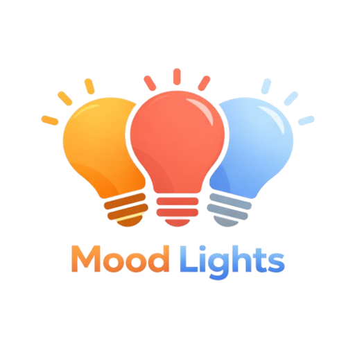

# MoodLights



Easy mood-based light management for Home Assistant.

[](https://github.com/pranjal-joshi/moodlights/releases)

[](LICENSE)
[](https://www.python.org/)

## Features

- **Mood Entities**: Create mood configurations with Activate and Revert buttons
- **Per-Light Settings**: Configure brightness, color temperature, and RGB color for each light
- **Cover Entity Support**: Control blinds, curtains, and shades with position and tilt support
- **State Save & Restore**: Automatically saves light and cover states before mood changes, allows easy rollback
- **Callable Services**: Integrate with automations via Home Assistant services

## Installation

[](https://my.home-assistant.io/redirect/hacs_repository/?owner=pranjal-joshi&repository=moodlights&category=integration)

### Option 1: HACS (Recommended)

1. Open Home Assistant
2. Go to HACS -> Integrations
3. Click the "+" button
4. Search for "MoodLights"
5. Click Install

### Option 2: Manual

1. Download the latest release
2. Extract the `custom_components/moodlights` folder to your Home Assistant's `config/custom_components/` directory
3. Restart Home Assistant

## Configuration

[](https://my.home-assistant.io/redirect/config_flow_start/?domain=moodlights)

### Via UI

1. Go to Settings -> Devices & Services
2. Click "Add Integration"
3. Search for "MoodLights"
4. Follow the configuration wizard

### Creating a Mood

1. Start the configuration wizard
2. Give your mood a name (e.g., "Living Room Evening")
3. Select lights for this mood
4. Configure each light's settings (brightness, color temperature, RGB color)

## Usage

### Via Buttons

- Click the **Activate** button to apply a mood
- Click the **Revert** button to restore the previous light states

### Via Services

```yaml
# Activate a mood
service: moodlights.activate_mood
data:
  mood_name: "Movie Night"

# Restore previous state
service: moodlights.restore_previous
data:
  mood_name: "Movie Night"

# Manually save current state
service: moodlights.save_state
data:
  mood_name: "Movie Night"
  preset_name: "Before Movie"
```

## State Management

MoodLights automatically saves light states before applying a new mood:

- Saves up to 3 previous states per mood
- States are stored in memory and cleared on HA restart
- Use `restore_previous` service to revert to the previous state

## Requirements

- Home Assistant 2024.10.0 or higher
- Python 3.12+

## Support

- [Issue Tracker](https://github.com/pranjal-joshi/moodlights/issues)
- [Discussions](https://github.com/pranjal-joshi/moodlights/discussions)

## Contributing

Contributions are welcome! Please read the [contributing guidelines](CONTRIBUTING.md) first.

## License

This project is licensed under the MIT License - see the [LICENSE](LICENSE) file for details.

---

*If you find this integration useful, please consider giving it a star on GitHub!*

## Star History

[](https://www.star-history.com/?repos=pranjal-joshi%2Fmoodlights&type=date&legend=top-left)
